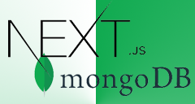

<a name="readme-top"></a>

<!-- PROJECT LOGO -->
<br />
<div align="center">
  <a href="https://github.com/othneildrew/Best-README-Template">
    
  </a>

  <h3 align="center">Next JS + MongoDB App</h3>
  <h4>CRUD Functionality</h4>

  <p align="center">
    A Sample CRUD Functionality built with NextJS and MongoDB .
   
</div>

<!-- ABOUT THE PROJECT -->

## About The Project

![Product Name Screen Shot][product-screenshot]

This project covers only the basic functionality on how to create, read, update, and delete data using NextJS with MongoDB. It also has authentication functionality, where the user can sign up and sign in. Moreover, it uses a creative-tim template for the design built on top of Tailwind CSS.

### Built With

- NextJS
- MongoDB
- TailwindCSS

<!-- GETTING STARTED -->

## Getting Started

### Prerequisites

Developer must have the following.

- [NodeJS](https://nodejs.org/en)
- [MongoDB Compass](https://www.mongodb.com/products/tools/compass)
- [Cloudinary API Key](https://cloudinary.com/) - (Storing Photos)

### Installation

Steps on how to install the project locally:

1. Clone the repo
   ```sh
   git clone https://github.com/wilken311/nextjs-mongodb-crud-app.git
   ```
2. Install NPM packages
   ```sh
   npm install
   ```
3. Create `.env.local.`file: For more info visit [Environmental Variables](https://nextjs.org/docs/pages/building-your-application/configuring/environment-variables)

   ```sh
   MONGODB_URI="mongodb://0.0.0.0:27017"
   MONGODB_DB="NAME OF YOUR DATABASE"
   DEV_URL="http://localhost:3000"
   CLOUDINARY_URL="ENTER YOUR CLOUDINARY API"
   NODE_ENV="NODE_ENV";
   ```

4. Run the app.
   ```js
   npm run dev;
   ```

<!-- ROADMAP -->

## Roadmap

- [x] Sign-Up
- [x] Sign-In / Sign Out
- [x] Create Data
- [x] Read Data
- [x] Update Data
- [x] Delete Data
- [x] Upload Photo

<!-- CONTRIBUTING -->

## Contributing

Contributions are what make the open source community such an amazing place to learn, inspire, and create. Any contributions you make are **greatly appreciated**.

If you have a suggestion that would make this better, please fork the repo and create a pull request. You can also simply open an issue with the tag "enhancement".
Don't forget to give the project a star! Thanks again!

1. Fork the Project
2. Create your Feature Branch (`git checkout -b feature/AmazingFeature`)
3. Commit your Changes (`git commit -m 'Add some AmazingFeature'`)
4. Push to the Branch (`git push origin feature/AmazingFeature`)
5. Open a Pull Request

<p align="right">(<a href="#readme-top">back to top</a>)</p>

<!-- LICENSE -->

## License

Distributed under the MIT License. See `LICENSE.txt` for more information.

<!-- ACKNOWLEDGMENTS -->

## Acknowledgments

Credits to the following:

- [NextJS](https://nextjs.org/)
- [Mongodb](https://www.mongodb.com/)
- [Notus Tailwind JS](https://www.creative-tim.com/product/notus-js)
- [Cloudinary](https://cloudinary.com/)
- [Hoangvvo](https://github.com/hoangvvo/nextjs-mongodb-app?tab=readme-ov-file)

[product-screenshot]: public/assets/img/screenshots.jpg
